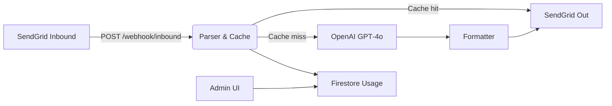

## 1 · Executive Summary
EmailLM lets anyone send an email to **AnyTopic@emaillm.com** and receive an AI‑generated reply.
This track uses **Windsurf** (agent‑first IDE + deploy) for development and CI/CD.

### Success metrics
| Metric | Target |
| ------ | ------ |
| Median reply time | ≤ 6 s |
| Day‑7 retention | ≥ 35 % |
| Cache hit rate | ≥ 60 % |

## 2 · Core capabilities (MVP)
1. Inbound email reception (SendGrid webhook)
2. Alias‑based topic extraction + NL fallback
3. Daily cache (`alias#YYYY‑MM‑DD#ctxHash`)
4. GPT‑4o‑mini response
5. Outbound email send (SendGrid)
6. Freemium quota + Stripe billing
7. Admin dashboard (usage, resend, cache stats)

## 3 · Architecture

## 4 · Prerequisites
* Windsurf account (or local CLI)
* GitHub repo & Actions
* SendGrid & OpenAI keys
* Stripe account